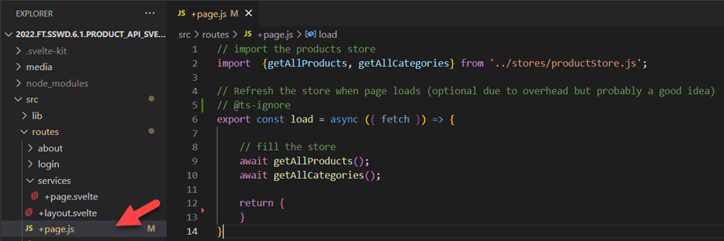
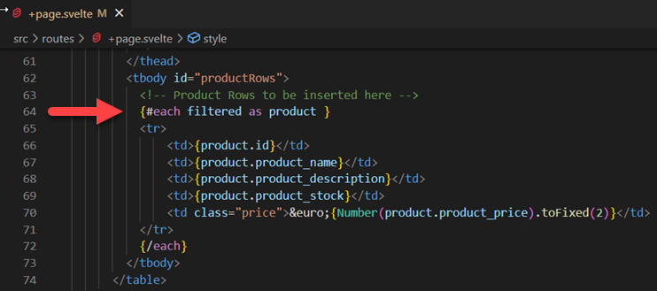
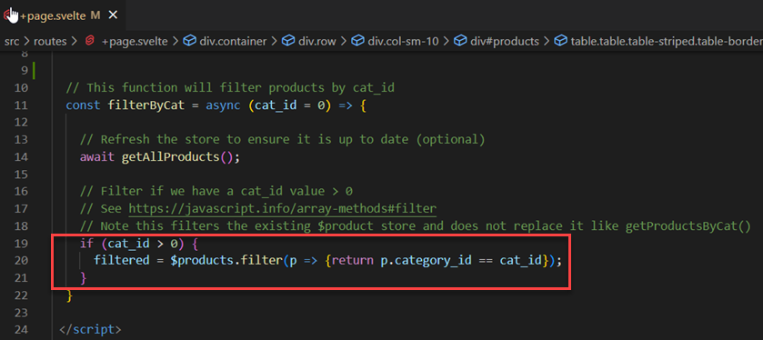
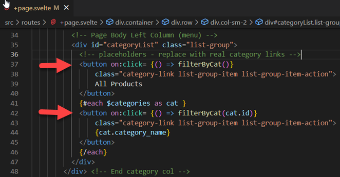
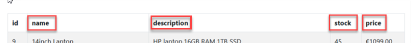

# Web API Client: Part 2 - filtering products

Enda Lee 2022

### Quick Start

1. Make sure the `Server API` app is running on http://localhost:5001
- See https://github.com/elee-tudublin/2022.FT.SSWD.5.4.product_api_sveltekit_client_complete
2. Download the start site from this repository.
3. Open in VS Code (separate to the server API instance).
4. In a terminal run `npm install`.
5. Start the application using `npm run dev`.
6. Open the client site: http://localhost:5173


## Introduction

In part 1, clicking a category called the API to the get products by category id, e.g. **``localhost:5001/product/bycat/2``**. This method works well but requires a server call for each 'filter' request. This lab will look at an alternative where filtering is carried out on the client side.


## 1. Pre-requisites

The application will use **separate** **`client`** and **`server`** applications which should be opened in separate VS Code instances when working on this lab.

When everything is up and running, you should see the finished part 1 lab.


with some changes...

## 2. `+page.js`

This script is loaded before **`+page.svelte`**. It main purpose here is to fill the store before the page is displayed. This is to ensure that the latest database data is displayed,




## 2. `+page.svelte`

This is where you will find the main changes.


#### 2.1 Use of **`$: filtered`**

In order to store a filtered version of the products list from the store, `$: filtered` is declared in the `<script>` block. It is set equal to `$products`. The **`$:`** syntax is used to 'subscribe' `filtered` to `$products` so that it is kept updated.  

![]./media/filtered.png)


`filtered` is then used in place of `$product` further down in the table.




#### 2.2 filter by category id

The result will be the same as before - only display products for the selected category, but this time the filtering is carried out on the **product store** and does not require an API call.

The function stats with `$products`, which contains the full list and then uses the JavaScript array filter method to return only products with a matching `category_id`. The filtered list is assigned to `filtered` which causes the displayed product list to update.

 


**`filterByCat()`** is called whenever a category link is clicked (as before):




## Exercises

1. Add filters to the product table headers so that the table is sorted  (ascending or descending order alphabetically or numerically)  when they are clicked.


- These links may help:
  - https://javascript.info/array-methods#filter

  - https://javascript.info/array-methods#sort-fn


2. Add a search feature which accepts search words via a text input.

   - Use the search words to filter product_name and/ or product_description

   - See: https://svelte.dev/tutorial/text-inputs
   - Svelte Dom event handling: https://svelte.dev/tutorial/dom-events

   - This code example will help - try it in your browser console

     ```javascript
         // array
         const arr = ['The', 'quick', 'brown', 'fox', 'jumped', 'over', 'the', 'lazy', 'dog'];
     
         // search for array elements which include 'o'
         let search_result = arr.filter((str) => {return str.includes('o');});
     
         console.log(search_result);
     ```

     

3. Use **svelte-simple-datatables** to display products

-  add a new page based on the existing product page (`routes/+page.js` and `routes/+page.svelte`). Use `/datatables` as the route and add a link to the nav menu.
-  https://github.com/vincjo/svelte-simple-datatables

**Note**, this component must run in browser, use an if block ( https://svelte.dev/tutorial/else-if-blocks) around your datatable to check if running in browser,

```html
<script>
  import { browser } from '$app/environment';
</script>

<html>
    {#if browser}
    	<!-- only runs in browser and will not be server rendered -->
    	<table>
        <!-- rows etc. -->    
    	</table>
    {/if}
</html>
```


------

Enda Lee 2022
